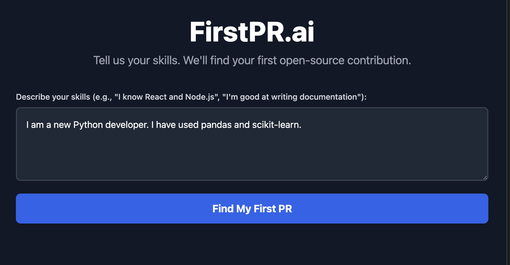

# First-PR: Good First Issue Finder

## Project Overview


First-PR is a web application designed to help new contributors find suitable "good first issues" on GitHub. Users can describe their skills and interests, and the application will match them with relevant issues from a curated list of open-source repositories, making it easier to make their first contribution.




## Features

*   **Skill-Based Matching:** Input your skills and get matched with relevant "good first issues."
*   **AI-Powered Recommendations:** Utilizes SentenceTransformers to embed user profiles and issue descriptions for accurate similarity matching.
*   **Curated Repositories:** Scans a predefined list of GitHub repositories for beginner-friendly issues.
*   **User-Friendly Interface:** A simple and intuitive React frontend to interact with the matching service.

## Technologies Used

### Backend

*   **Python:** The core language for the backend logic.
*   **FastAPI:** A modern, fast (high-performance) web framework for building APIs with Python 3.7+ based on standard Python type hints.
*   **SentenceTransformers:** For generating embeddings of text (user skills and issue descriptions) to enable semantic search.
*   **SQLite:** A lightweight, file-based database used to store GitHub issue data.
*   **Uvicorn:** An ASGI server for running the FastAPI application.

### Frontend

*   **React:** A JavaScript library for building user interfaces.
*   **Vite:** A fast frontend build tool that provides an extremely quick development experience.
*   **Tailwind CSS:** A utility-first CSS framework for rapidly building custom designs.

## Setup and Installation

Follow these steps to get the project up and running on your local machine.

### Prerequisites

*   Python 3.8+
*   Node.js (LTS recommended)
*   npm or yarn

### 1. Clone the Repository

```bash
git clone https://github.com/your-username/First-PR.git
cd First-PR
```

### 2. Backend Setup

Navigate to the `backend` directory, create a virtual environment, install dependencies, and populate the database.

```bash
cd backend
python -m venv .venv
source .venv/bin/activate  # On Windows use `.\.venv\Scripts\activate`
pip install -r requirements.txt

# Populate the database with GitHub issues
python scanner.py
```

### 3. Frontend Setup

Open a new terminal, navigate to the `frontend` directory, and install dependencies.

```bash
cd ../frontend
npm install # or yarn install
```

## Running the Application

### 1. Start the Backend Server

In the `backend` directory (where you ran `scanner.py`):

```bash
source .venv/bin/activate # If not already active
uvicorn main:app --reload
```

The backend server will typically run on `http://127.0.0.1:8000`.

### 2. Start the Frontend Development Server

In the `frontend` directory:

```bash
npm run dev # or yarn dev
```

The frontend application will typically open in your browser at `http://localhost:5173` (or another port if 5173 is in use).

## How to Use

1.  Open your web browser and navigate to the frontend application URL (e.g., `http://localhost:5173`).
2.  Enter your skills, programming languages, or areas of interest into the provided text input field.
3.  Click the "Find Issues" button.
4.  The application will display a list of "good first issues" from various GitHub repositories, ranked by their relevance to your input.

## Project Structure

```
First-PR/
├── backend/                 # Python FastAPI backend
│   ├── database.py          # SQLite database connection and schema
│   ├── main.py              # FastAPI application entry point, API routes
│   ├── models/              # Pydantic models for data validation
│   ├── scanner.py           # Script to fetch GitHub issues and populate DB
│   └── services/            # Core AI matching logic and database interactions
├── frontend/                # React.js / Vite frontend
│   ├── public/              # Static assets
│   ├── src/                 # React source code
│   │   ├── App.jsx          # Main application component
│   │   ├── main.jsx         # Entry point for React app
│   │   └── ...              # Other components and styles
├── .gitignore               # Git ignore rules
├── app.db                   # SQLite database file (generated)
├── LICENSE                  # Project license
├── README.md                # This file
└── requirements.txt         # Python dependencies
```

## Contributing

Contributions are welcome! If you'd like to contribute, please fork the repository, create a new branch, and submit a pull request. For major changes, please open an issue first to discuss what you would like to change.

## License

This project is licensed under the [MIT License](LICENSE).